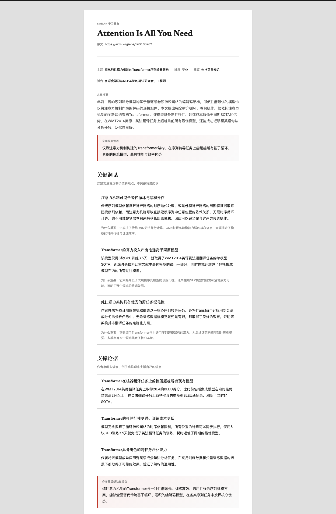

## Sonar


大多数文章工具给你的，是一段摘要。

Sonar 给你的，是一条学习路径。

输入文章 URL 或本地文件，Sonar 会把论文、技术博客、教程等内容转换成结构化学习报告，帮助你回答几个更关键的问题：

- 这篇文章到底在讲什么
- 哪些概念最关键
- 你可能缺哪些前置知识
- 应该按什么顺序理解它
- 接下来该读什么

Sonar 面向的不是“快速看完一篇文章”的场景，
而是“我真的想把这篇文章读懂”的场景。

> Sonar turns dense articles into structured learning paths.

## 一眼看懂

- 输入一篇文章 URL 或本地文件
- 自动判断主题、难度和阅读建议
- 识别核心概念与前置知识
- 为关键概念补充解释、资料和学习顺序
- 输出可分享的 HTML 学习报告

## Why Sonar

### 1. 不只总结，而是帮你建立理解路径

普通摘要工具通常只能回答“这篇文章讲了什么”。  
Sonar 重点回答的是“为了真正读懂它，你还缺什么，以及接下来该怎么学”。

### 2. 把理解过程拆成可检查的阶段

Sonar 不是一次性吐出结果，而是把流程拆成 `Fetch → Analyze → Plan → Research → Review → Synthesize`。  
这让结果更可追溯，也支持断点恢复和后续调试。

### 3. 同时适合深读和快速浏览

如果你只想要核心观点，可以用 `reading`。  
如果你需要概念解释、前置知识和学习路径，可以用 `explain`。

### 4. 输出的是可复用报告，不是一段聊天记录

最终结果会渲染成 HTML 报告，并保留每个阶段的 JSON 快照。  
它适合分享、归档、复盘，也适合继续迭代。

## 适合的场景

- 读论文前先建立主题和前置知识地图
- 看技术博客时快速拆出核心概念和学习顺序
- 面对陌生领域文章时先判断值不值得深读
- 为团队成员生成统一格式的阅读材料

## 工作方式

```text
Input URL / File
  -> Fetch content
  -> Analyze article
  -> Plan learning focus
  -> Research concepts
  -> Review weak spots
  -> Synthesize final report
  -> Render HTML
```

## See It In Action

给 Sonar 一篇技术文章或论文后，你最终拿到的不是一段聊天式回答，而是一份可分享、可复盘的 HTML 报告。



一个典型结果通常会把原文拆成这些层次：

- `Overview`：主题、目标读者、阅读难度、是否建议先补前置知识
- `Summary`：核心内容浓缩
- `Article Analysis`：核心论点、关键洞见、支撑论据
- `Concepts`：需要理解的概念与术语
- `Prerequisites`：可能缺失的前置知识
- `Learning Path`：建议的学习顺序与下一步阅读

## Real Example

最近一次真实运行中，Sonar 分析了这篇内容：

- 输入：[Attention Is All You Need](https://arxiv.org/abs/1706.03762)
- 主题判断：提出纯注意力机制的 Transformer 序列转导架构
- 目标读者：有深度学习与 NLP 基础的算法研究者、工程师
- 阅读建议：`learn_prerequisites`

Sonar 在这次运行里做出的，不只是摘要，还包括：

- 拆出文章核心论点和关键洞见
- 识别 3 个必须先补的前置知识，例如“循环神经网络”“卷积神经网络（CNN）”“编解码架构”
- 生成 5 步学习路径，从传统序列模型缺陷一路过渡到 Transformer 架构设计
- 输出最终 HTML 报告，并保留完整阶段快照供复盘

这类案例比单纯展示命令更能说明 Sonar 的价值，因为它直接展示了“从文章到学习路径”的转化结果。

## Sonar vs. "Just Summarize It"

| 问题                   | 普通摘要工具   | Sonar                        |
| ---------------------- | -------------- | ---------------------------- |
| 这篇文章讲了什么       | 能回答         | 能回答                       |
| 作者最核心的观点是什么 | 偶尔能答好     | 结构化拆解                   |
| 我为什么没看懂         | 很少回答       | 会识别前置知识缺口           |
| 我应该先学什么         | 通常不给路径   | 提供学习顺序                 |
| 我下一步该读什么       | 偶尔给几个链接 | 结合概念研究输出延伸阅读     |
| 结果能否复盘和恢复     | 通常不行       | 保留阶段快照和最终 HTML 报告 |

## 为什么不是普通摘要工具

看不懂一篇文章时，问题通常不是“没有摘要”，而是：

- 你不知道作者真正想表达什么
- 你不知道卡住你的前置知识是什么
- 你不知道应该先补哪个概念
- 你不知道下一步该读什么资料

Sonar 的目标不是把文章缩短，而是把一篇难文章拆成一份可学习、可执行、可追溯的学习报告。

## 你会得到什么

给 Sonar 一篇文章后，它会生成一份结构化报告，通常包含：

- 文章主题、难度和阅读建议
- 核心论点、关键洞见和支撑论据
- 需要理解的核心概念与前置知识
- 概念解释、补充资料和学习路径
- 最终可分享的 HTML 报告

## 适合谁

- 想读懂技术博客、论文、教程的工程师和学生
- 需要快速建立陌生主题认知框架的人
- 不满足于“看完摘要”，而是想真正理解内容的人

## 快速示例

```bash
# 把一篇技术文章变成完整学习报告
uv run main.py https://example.com/some-article

# 把一篇论文 PDF 变成可分享的 HTML 报告
uv run main.py ./paper.pdf

# 按你的学习目标重排重点
uv run main.py ./paper.pdf --goal "我想先理解这篇文章里的系统设计权衡"
```

输出结果位于：

- `output/runs/<run_id>/report.html`
- `output/runs/<run_id>/*.json`
- `output/report.html`（最近一次结果）

## Quickstart

```bash
# 1) 安装依赖
uv sync

# 2) 配置环境变量
cp .env.example .env

# 3) 分析网页文章（概念解读，默认模式）
uv run main.py https://example.com/some-article

# 4) 分析本地文件（支持 .pdf / .md / .txt / .html）
uv run main.py ./paper.pdf
```

## 报告模式

| 模式                     | 说明                                       | 流程                                           | 成本             |
| ------------------------ | ------------------------------------------ | ---------------------------------------------- | ---------------- |
| `--mode reading`         | 快速摘要：核心论点、关键洞见               | Fetch → Analyze → 渲染                         | 2 次 LLM，无搜索 |
| `--mode explain`（默认） | 完整学习报告：概念解释、学习路径、延伸阅读 | Fetch → Analyze → Plan → Research → Synthesize | 多次 LLM + 搜索  |

如果你只想知道“这篇文章说了什么”，用 `reading`。  
如果你想知道“我该怎么把它读懂”，用 `explain`。

## CLI 用法

输入可以是 URL 或本地文件路径：

```bash
# 完整学习报告（默认，适合任何类型的文章）
uv run main.py <URL或文件>

# 快速摘要（摘要 + 观点拆解，不做概念研究）
uv run main.py <URL或文件> --mode reading
```

额外选项：

```bash
# 自定义学习目标（LLM 会据此筛选和排序概念）
uv run main.py <URL或文件> --goal "我想理解这篇文章里的系统设计权衡"
```

断点恢复：

```bash
# 从 analyze 阶段恢复（默认使用最近一次 run）
uv run main.py --resume-from analyze

# 指定 run_id 恢复
uv run main.py --run-id 20260307-demo --resume-from research
```

## 输出目录

- 每次运行输出到 `output/runs/<run_id>/`
- 阶段快照：`fetch.json / analyze.json / plan.json / research.json / synthesize.json`
- 报告：`report.html`
- `output/report.html` 始终指向最近一次结果

这意味着 Sonar 不只是吐出最终结果，也会保留中间推理产物，方便你调试、复盘和断点恢复。

## 配置

### LLM（OpenAI 兼容）

```env
OPENAI_API_KEY=sk-xxx
OPENAI_BASE_URL=https://api.openai.com/v1
OPENAI_MODEL=gpt-4o
```

### Amazon Bedrock（OpenAI 兼容网关）

```env
OPENAI_BASE_URL=https://bedrock-mantle.<region>.api.aws/v1
OPENAI_MODEL=us.anthropic.claude-3-7-sonnet-20250219-v1:0
AWS_BEARER_TOKEN_BEDROCK=...
```

### 搜索后端

```env
# Tavily（默认）
TAVILY_API_KEY=tvly-xxx

# DuckDuckGo（无需 API key，适合开发）
SEARCH_BACKEND=duckduckgo
```

## 可选依赖

本地内容质量分类器依赖较重（`torch`/`transformers`），默认不安装。只执行 `uv sync` 也可以正常运行，程序会自动降级到 LLM 质量检查；如果想启用本地分类器，再额外安装：

```bash
uv sync --extra local-classifier
```

## 架构

```
main.py (CLI)
  → pipeline.py (编排)
      → fetchers/          输入层：BaseFetcher 接口 + 路由
      │   local_file.py      本地文件 (.pdf/.md/.txt/.html)
      │   url.py             URL (Jina → Crawl4AI → httpx 降级链)
      → stages/            处理层：Analyze → Plan → Research → Synthesize
      → report/            输出层：HTML 渲染
```

扩展新输入类型（如 YouTube、GitHub 仓库）：在 `fetchers/` 下新建文件实现 `BaseFetcher`，注册到 `fetchers/__init__.py` 即可。

## 开发与贡献

```bash
# 安装开发依赖
uv sync --group dev

# 运行测试与 lint
uv run pytest
uv run ruff check tests
```
